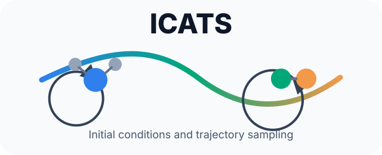
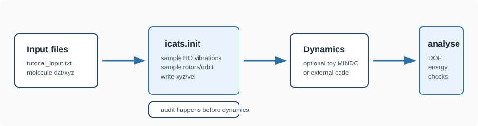

# ICATS Manual

ICATS generates molecular-scattering initial conditions and analysis diagnostics
for quasi-classical trajectory workflows. This manual is a working guide to the
whole pipeline: install the code, generate initial conditions, run the provided
tutorials, inspect Wang-Landau sampling, run cheap MINDO dynamics, and interpret
the analysis output.

The emphasis is practical: run a small example, understand the files it creates,
and learn the checks that make an ensemble worth trusting before committing to a
larger trajectory set.

## Contents

- [Installation](installation.md)
- [Quick Start](quick-start.md)
- [Tutorials](tutorials.md)
- [Input Files](input-files.md)
- [Wang-Landau Sampling](wang-landau.md)
- [Initial-Condition Theory](theory.md)
- [Visual Guide](visual-guide.md)
- [Annotated First Output](annotated-output.md)
- [Dynamics and Analysis Pipeline](pipeline.md)
- [Diagnostics and Audits](diagnostics.md)
- [Troubleshooting](troubleshooting.md)
- [School and Outreach Videos](videos.md)

## What ICATS Does

ICATS starts from two molecule definitions and a plain-text scattering input
file. It samples vibrational, rotational, orientational, and intermolecular
degrees of freedom, converts those samples into Cartesian coordinates and
velocities, and writes files that can be passed to a trajectory code.

The same code can analyse Cartesian trajectory output and reconstruct the
internal components: vibrational mode energies, molecular angular momenta,
intermolecular angular momentum, and energy decomposition.

The program follows the same structure as the accompanying theory document:
incoming molecules are assumed to be well separated, each molecule is described
with harmonic-oscillator and rigid-rotor approximations, and the relative
collision motion is represented with Jacobi coordinates, impact parameters, and
orbital angular momentum.

## What To Read First

1. Install ICATS using [Installation](installation.md).
2. Run the [Quick Start](quick-start.md).
3. Read [Annotated First Output](annotated-output.md) while looking at the first
   generated log.
4. Use [Visual Guide](visual-guide.md) to connect the main coordinates and
   angular momenta to the diagrams.
5. Use [Diagnostics and Audits](diagnostics.md) to check that the generated
   initial conditions make sense.
6. Read [Initial-Condition Theory](theory.md) when the output terms need
   interpretation.
