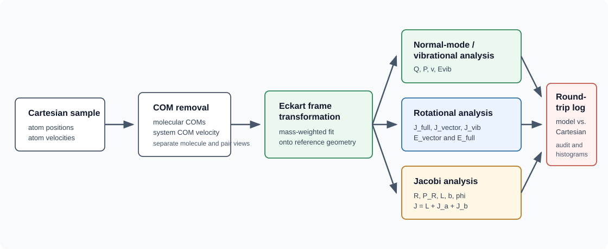

# Initial-Condition Theory



For the main coordinate and angular-momentum diagrams, see the
[Visual Guide](visual-guide.md).

This page explains the model ICATS uses and, just as importantly, how the code
turns that model into the quantities printed in the analysis files. The aim is
not to reproduce the full manuscript. The aim is to make the program output
readable.

The central approximation is the entrance-channel separation used in the
manuscript. Before collision, the two molecules are assumed to be far enough
apart that the intramolecular potentials are independent of the intermolecular
interaction. ICATS therefore builds each initial condition from four pieces:

- molecular vibrations, treated as harmonic oscillator normal modes,
- molecular rotations, treated with a rigid-rotor/vector-model description,
- molecular orientation in the space-fixed frame,
- intermolecular Jacobi motion, described by relative velocity, separation,
  impact parameter, orbital angular momentum, and total angular momentum.

The code first samples these model variables, then converts them into Cartesian
atomic positions and velocities. The analysis code then performs the reverse
projection:

```text
model variables -> Cartesian x/v -> reconstructed model variables
```

This round trip is why the analysis output is useful even before dynamics. It
checks whether the sampled internal state survived the conversion to atom-wise
Cartesian coordinates and velocities.

## Why These Sampling Tools

ICATS uses three specialised ideas because the three parts of the entrance
channel have different natural variables.

For vibrations, the natural model is a harmonic oscillator in normal-mode
phase space. ICATS therefore samples a vibrational quantum number and then
samples dimensionless `Q, P` coordinates from an energy-matched
leading-Wigner sampler. This gives Cartesian displacements and velocities that
retain the harmonic oscillator energy and uncertainty-like spread expected
from the chosen state.

```text
E_HO,k = 0.5 * omega_k * (Q_k^2 + P_k^2)
E_v,k  = omega_k * (v_k + 0.5)
```

The first expression is the classical phase-point energy reconstructed from the
sampled `Q, P` values. The second is the harmonic-oscillator level energy used
when assigning Boltzmann populations. A single leading-Wigner phase-space draw
does not have to make these two numbers identical mode by mode, but the
ensemble radial moment preserves the oscillator ladder,
`<0.5*(Q^2+P^2)> = v + 0.5`.

The name is deliberately not just "Husimi". The textbook Husimi function is the
Gaussian-smoothed Wigner function and is positive, but in these scaled
coordinates its direct radial form does not reproduce the oscillator energy
moment used by the sampler. ICATS instead uses a positive leading-Wigner form, denoted `f_LW` in the manuscript:
it keeps the Wigner Gaussian envelope and uses the radial density
`x^(2v) exp(-x)` with `x = Q^2 + P^2`, so `x` follows a Gamma distribution with
shape `2v + 1`.

For molecular rotations, the natural variables are angular momenta rather than
Cartesian velocities. ICATS therefore uses a quasi-classical vector model:
sample a rotational state, construct a classical angular momentum vector with
length close to `sqrt(J(J+1))`, then convert that vector into an angular
velocity field on the reference geometry.

```text
|J_vector| = sqrt(J(J+1))
omega_ref  = inverse(I_ref) * J_vector
v_rot,i    = omega_ref cross x_ref,i
```

For intermolecular scattering, the natural classical variable is the impact
parameter, while the partial-wave view is organised by total angular momentum.
For atoms these almost coincide because `J = L`. For molecules, however,
`J = L + Jab`, where `Jab` comes from the molecular rotors. Wang-Landau sampling
is used to balance these views without manually forcing the angle between `L`
and `Jab`.

```text
d sigma       proportional to b db
P(L) dL       proportional to (2L + 1) dL
J             = L + J_AB
J_AB          = J_A + J_B
P_acc(J)      proportional to (2J + 1) / Omega_t(J)
```

During the Wang-Landau optimization, `Omega_t(J)` is the running trial estimate of the `J` density produced by the proposal samples. After convergence, the same array is used as the estimated `J`-density of states (`J`-DOS). The expression above
is the default `wl-target = linear-j` form used with geometric orbital
sampling. For `orbital-sampling = flat-l`, ICATS uses `wl-target = flat-j` and
therefore

```text
P_acc(J) proportional to 1 / Omega_t(J)
```

This second mode is intended for diagnostic or reweighting workflows where `L`
is proposed uniformly and the user later applies the desired `L`/`b` weights.

## Distributions Used In ICATS

Most ICATS input options eventually define one of the following distributions.
The names in the middle column are the code-level ideas a user will see in
logs, histogram file names, or input options.

| Type | Sampled quantity | Distribution or weight |
| --- | --- | --- |
| Vibrational state | normal-mode quantum numbers `vstat` | Boltzmann harmonic-oscillator populations, `P(v) proportional to exp[-E_v/(k_B T_vib)]` |
| Vibrational phase space | normal-mode `Q, P` | Energy-matched leading-Wigner harmonic-oscillator phase-space density for the sampled `vstat` |
| Rigid-rotor total angular momentum | molecular `J` | Boltzmann rotor populations with the field-free `(2J + 1)` projection-state count; asymmetric tops add state-specific projection/eigenstate sampling at fixed `J` |
| Symmetric-top projection | body-fixed `K` or projection-like coordinate | Boltzmann projection distribution at fixed `J` |
| Asymmetric-top state | Wang-basis eigenstate at fixed `J` | Boltzmann distribution over asymmetric-rotor eigenenergies and symmetry labels |
| Asymmetric vector model | projection spread and unresolved azimuth | rejection-sampled Gaussian-sine, azimuthal, or Bingham-like auxiliary distributions chosen from the Wang-state expectation values |
| Molecular orientation | Euler angles | isotropic orientations by default, or fixed/user-supplied orientation PDFs through `orientation-mode` |
| Impact parameter | `b` | geometric incoming-flux measure, `P(b) db proportional to b db` on the requested interval |
| Orbital angular momentum | `L` | geometric/default proposal, `P(L) dL proportional to (2L + 1) dL`, or uniform proposal with `orbital-sampling = flat-l` |
| Total angular momentum | `J` | default target partial-wave measure, `P(J) dJ proportional to (2J + 1) dJ`, or approximately flat target with `wl-target = flat-j` |
| Orbital azimuth | `phi` | uniform angle when `phisample = True` |
| Relative speed | intermolecular velocity | Crossed-beam molecular speed distributions, direct relative-speed/channel input, or Maxwell-Boltzmann relative-speed sampling, depending on input mode |
| Wang-Landau correction | accepted total `J` | rejection weight proportional to `(2J + 1) / Omega_t(J)` for `linear-j`, or `1 / Omega_t(J)` for `flat-j` |

The important practical point is that these distributions are not all sampled
at the same level. Vibrational and rotor state distributions define internal
molecular states. Orientational and phase-space distributions turn those states
into Cartesian coordinates and velocities. Intermolecular distributions define
the incoming collision geometry. Wang-Landau then acts on the combined trial
sample, after `L`, `J_A`, and `J_B` have already produced a candidate total
angular momentum.

## User Orientation PDFs

By default, molecular orientations are isotropic. A molecule file can instead
request a fixed Euler orientation or a user-supplied PDF:

```text
orientation-mode = fixed alpha beta gamma
orientation-mode = pdf orientation_pdfs.py orient_pdf p1 p2 ...
orientation-frame = scattering
orientation-thin = 25
```

The PDF function is evaluated as:

```python
orient_pdf(alpha, beta, gamma, *pars)
```

where `alpha,beta,gamma` are molecular Euler angles in radians. The function
returns only the physical orientation weight. ICATS multiplies this by the
Euler measure `sin(beta)` during Monte Carlo sampling:

```text
P_sample(alpha,beta,gamma) proportional to
    orient_pdf(alpha,beta,gamma) * sin(beta)
```

The user function should not include the `sin(beta)` measure itself. It must
return a finite, non-negative value for every sampled orientation. This keeps
the user PDF as the statement of the physical preparation, while ICATS handles
the angular coordinate measure.

A user orientation PDF biases the sampled Euler angles after the field-free
rotor state has been selected. It does not remove the molecular `(2J + 1)`
projection-state count used when sampling the rotor quantum number `J`.

The current frame option is `orientation-frame = scattering`. This means that
the PDF is expressed in the ICATS space-fixed scattering frame, where the
incoming Jacobi relative momentum defines the collision axis. If a real
experiment defines the field or laser polarization in a different lab frame,
that axis should be rotated into the scattering frame inside the user PDF. This
keeps the molecule-level polarization separate from the impact-parameter
azimuth `impact-phi`, which controls the collision plane.

## Intermolecular Velocity Ensembles

The incoming translational motion can be interpreted in two different ways.

In a crossed-beam interpretation, each molecule has its own beam speed
distribution. ICATS samples the two molecular centre-of-mass speeds separately
from the molecule-file `vel` entries, then combines them using the requested
`beam-angle`. This produces the Jacobi relative speed and therefore the
collision energy:

```text
v_rel^2 = v_A^2 + v_B^2 - 2 v_A v_B cos(beam_angle)
E_coll  = 0.5 * mu * v_rel^2
```

This is the natural model for a crossed-beam experiment where the beam
velocities and crossing angle are known.

In a direct-channel interpretation, the user specifies the relative incoming
channel itself. The equivalent quantities are:

```text
p0     = mu * v_rel
E_coll = p0^2 / (2 * mu)
k      = p0 / hbar
```

Since ICATS uses atomic units internally, `hbar = 1`, so the numerical values
of `incoming-p0` and `incoming-k` are the same when both are expressed in
atomic units. This direct-channel setup is closest to the usual partial-wave
language, where an incoming channel is labelled by `k` and semiclassically
`L approx k b`.

## Generation-To-Analysis Workflow

For each accepted sample, ICATS follows a model-to-Cartesian-to-analysis
workflow. The exact helper-function names are implementation details, but the
physical order is:

1. Create a fresh two-molecule sample.

2. Sample the rotational state and orientation of each molecule.

3. Set the intermolecular angular-momentum trial.
   In the usual geometric or flat-`L` modes, ICATS samples the orbital angular
   momentum `L` first and then forms

   ```text
   J = L + J_AB
   ```

   In `fixed-b` mode, ICATS samples or sets the relative velocity first, then
   constructs the impact displacement so that the requested `b` and
   `impact-phi` give the corresponding orbital angular momentum.

4. Apply optional trial rejection.
   Non-Wang-Landau runs accept the trial after the ordinary range checks.
   Wang-Landau runs accept or reject the trial according to the stored or newly
   constructed `wang.pkl` umbrella for the requested `wl-target`.

5. Add intramolecular vibration.
   With `vib-mode = sample`, ICATS samples harmonic normal-mode states and
   phase-space coordinates. With `vib-mode = rigid`, this step is skipped and
   the reference geometry is kept.

6. Build the Cartesian sample.
   ICATS places the molecular centres of mass at the requested initial
   separation, applies the impact-parameter displacement, assigns the relative
   velocity, and combines the molecular internal coordinates and velocities
   into one Cartesian xyz/vel sample.

7. Apply the requested output frame.
   `output-frame = internal` leaves the historical ICATS convention unchanged.
   `output-frame = incoming-k-plus-z` rotates the completed sample by `Rx(pi)`
   before the generated diagnostics, immediate analysis, audit, and xyz/vel
   export are written.

8. Write generation-side diagnostics.
   The `generation` block records the sampled model quantities: rotor labels,
   molecular orientations, vibrational state/phase-space values,
   intermolecular velocity, `b`, `L`, `Jab`, and `J`.

9. Analyse the Cartesian sample immediately.
   The `analysis` block reconstructs the same categories from the Cartesian
   coordinates and velocities: molecular Euler angles, Eckart-frame rotation,
   vibrational mode coordinates where possible, Jacobi/system angles,
   intermolecular angular momentum, and energy decomposition.

10. Run the optional initial-condition audit.
    When `audit-initial-sample = True`, ICATS compares generation and analysis
    values before any dynamics are run.

The generation and analysis blocks are intentionally both printed. When they
disagree beyond the expected tolerance, the disagreement tells you where the
model-to-Cartesian conversion, output-frame choice, or analysis assumptions
need attention.

## Frames Used By The Analysis

Several frames appear in the output:

- `space`: the external Cartesian frame used for the trajectory files.
- molecular COM frame: each molecule after removing its centre-of-mass position
  and velocity.
- Eckart frame: the instantaneous molecule rotated onto the reference geometry
  by the mass-weighted best-fit/Eckart alignment.
- instantaneous principal-axis frame: the frame that diagonalises the inertia
  tensor of the realised, possibly vibrationally distorted geometry.
- Jacobi/intermolecular frame: the two molecular centres of mass treated as a
  two-body problem.

The distinction between the reference and instantaneous geometries matters.
The sampled vector-model rotor is defined with the reference geometry. For a
propagated snapshot, the Eckart rotational energy uses the recovered angular
velocity and the inertia tensor of the realised distorted geometry.

## Euler Angles And Output Names

ICATS uses the same rotation convention as the manuscript, but older internal
keys used a less careful naming scheme. The current logs and manual use these
names:

| Quantity | Manuscript-style output | Meaning |
| --- | --- | --- |
| molecular orientation | `alpha, beta, gamma` | Euler rotation from the space-fixed frame into the molecule/Eckart frame. |
| system Jacobi embedding | `phi, beta, chi` | Euler rotation from the space-fixed frame into the two-vector body-fixed frame of the collision complex. |
| impact-parameter azimuth | `impact-phi` | Input/sample coordinate fixing the lab collision plane; not the full system Euler `phi`. |

The output logs also print `output frame`. The default value is `internal`, the
historical ICATS convention. `output-frame = incoming-k-plus-z` applies the
proper rotation `Rx(pi)` to the completed generated sample before reporting,
analysis, audit, and Cartesian export. This is the common scattering choice
where the incoming relative wave vector is parallel to the space-fixed `+Z`
axis. Because coordinates, velocities, vectors, and reconstructed SF/BF angles
all change, this is not a cosmetic label change.

The molecular Euler triple follows the usual `Z-Y-Z`/line-of-nodes
construction:

```text
R(alpha,beta,gamma) = R_Z(alpha) R_Y(beta) R_Z(gamma)
```

In the molecular output, `alpha` is the first azimuthal rotation about the
space-fixed axis, `beta` is the polar line-of-nodes rotation, and `gamma` is the
final body-fixed spin about the molecule's own axis. For atoms there is no
molecular orientation space. For linear molecules, the final spin about the
bond is arbitrary; ICATS reports `gamma = 0` for that gauge coordinate.

For the two-body collision analysis, the first embedding vector is the Jacobi
COM-to-COM vector:

```text
R_AB = R_A - R_B
```

ICATS computes the system angles from the generated Cartesian coordinates as

```text
phi  = atan2(R_y, R_x)
beta = acos(R_z / |R_AB|)
```

then uses a second molecular embedding vector to define the final azimuth
`chi` about the system body-fixed `z` axis. The sampled data still includes a
legacy key `theta`; it is an alias for this same system polar angle `beta`.

The practical output mapping is:

| Output block/key | Read as |
| --- | --- |
| `Orientations (alpha,beta,gamma)` | generated molecular orientation. |
| `Orientation, Euler Angles (alpha,beta,gamma)` | reconstructed molecular/Eckart orientation from Cartesian coordinates. |
| `System Euler (phi,beta,chi)` | reconstructed two-vector Jacobi/system embedding. |
| `Molecule (1) BF Euler`, `Molecule (2) BF Euler` | molecule frame angles after rotating into the system body-fixed frame. |
| `2bJac.theta` | legacy alias for `2bJac.beta`. |

This distinction matters in constrained runs. For example, `impact-phi = 0`
fixes the incoming impact-parameter plane, but it does not force a diatomic
molecule to be coplanar. The diatom orientation is still sampled through its
molecular `alpha,beta` angles, while its molecular `gamma` spin is arbitrary
and therefore reported as zero.

## Vibrational Sampling

The molecule setup constructs normal modes from the reference geometry and
Hessian. The Hessian supplied in the molecule file should be the full
mass-weighted Cartesian Hessian in atomic units, ordered as
`x1 y1 z1 x2 y2 z2 ...` in the same atom order as the reference geometry.
ICATS diagonalizes this matrix directly, so its eigenvalues should be
`omega^2`. The corresponding `omega` values are then used for harmonic
Boltzmann populations, leading-Wigner phase-space sampling, and vibrational
energy reconstruction.

This is distinct from several other common conventions in the literature. Do
not provide a mass-frequency-scaled Hessian, a normal-mode displacement matrix,
or an unweighted Cartesian force-constant matrix unless it has first been
converted to the mass-weighted atomic-unit form. After diagonalization, ICATS
removes the translational/rotational subspace and stores the transformation
matrices used by `molecules.SetHOVibrState` and `molecules.CalcInterEner`.

For each normal mode, ICATS samples:

- a vibrational quantum number `vstat` from a Boltzmann distribution,
- dimensionless normal coordinate `Q`,
- dimensionless normal momentum `P`.

The phase-space `Q, P` values are drawn from the leading-Wigner distributions
used by the sampler. The harmonic oscillator energy for one mode is then

```text
E_mode = 0.5 * omega * (Q^2 + P^2) = QE + PE
```

where `omega` is the mode frequency in atomic units. This is the quantity
printed as `EE (eV)` in the vibrational table. The coordinate and momentum
parts are printed separately as:

```text
QE = 0.5 * omega * Q^2
PE = 0.5 * omega * P^2
EE = QE + PE
```

The approximate state label `~vstat` printed by the analysis is

```text
~vstat = E_mode / omega - 0.5
```

This is not a new quantum measurement. It is a convenient way to express the
reconstructed classical oscillator energy in units of one vibrational quantum.

## Vibrational Analysis

`molecules.CalcInterEner` reconstructs the vibrational table from Cartesian
coordinates and velocities:

1. remove the molecular COM position and velocity,
2. rotate the instantaneous molecule into the Eckart frame,
3. subtract the reference geometry,
4. project out translation and rotation using the reference
   translation/rotation vectors,
5. transform the remaining displacement and momentum into normal-mode
   coordinates,
6. compute `Q`, `P`, `QE`, `PE`, and `EE`.

This is why the initial-sample audit is meaningful. The generated `Q, P`
variables are converted to Cartesian coordinates and velocities, then the
analysis tries to recover the same `Q, P` from the final Cartesian sample.

If the molecule is an atom, the analysis prints `vibrational space = none
(atom)`. If the molecule has internal coordinates but no Hessian/normal-mode
basis, ICATS does not invent a harmonic vibrational table. Instead it reports
an `internal residual`: the displacement, momentum, and kinetic-energy content
left after projecting the analysed Cartesian sample outside translation and
rotation. This is a geometry/velocity consistency check, not a normal-mode
energy decomposition.

## Rotational Sampling

Molecular rotations are sampled with the quasi-classical vector model. For a
sampled rotor state, the code builds a classical angular momentum vector with
length approximately

```text
|J| = sqrt(J(J+1))
```

and with a body-fixed projection determined by the sampled rotor state. For
symmetric-top-like cases this resembles the usual `J, K` vector-model picture.
For asymmetric tops, ICATS uses the asymmetric-top/Wang-state machinery in the
molecule setup to decide how the projection information is represented.

After the angular momentum vector is selected, `molecules.SetAngularVeloc`
constructs the rotational velocity field as

```text
omega = inverse(I_ref) * J_vector
v_rot = omega cross x_ref
```

where `I_ref` and `x_ref` belong to the reference/equilibrium Eckart geometry.
This is deliberate. The vector model describes the persistent rigid-rotor
motion of the reference structure. It should not be reconstructed from the
instantaneous vibrationally distorted geometry.

The corresponding reference-geometry rotor energy is

```text
E_vector = 0.5 * sum_i J_vector_i^2 / I_ref_i
```

This is the energy that should be compared to the sampled rigid-rotor energy
when validating the initial condition.

## Rotor Types

ICATS classifies each molecule from the principal moments of inertia of the
reference geometry. The code records a rotor type such as `atom`, `linear`,
`prolate`, `oblate`, `spherical`, `asym-prolate`, `asym-oblate`, or
`asym-spherical`.

Atoms have no molecular rotational or vibrational space in this model, so their
molecular `Trot` and `Tvib` are forced to zero.

Linear rotors have one vanishing principal moment. ICATS samples the total
rotational angular momentum and treats the body-fixed projection consistently
with the linear-rotor limit.

Near-symmetric tops, labelled `prolate` or `oblate`, are handled with the
standard vector-model picture: sample total `J`, sample the body-fixed
projection, choose the unresolved azimuthal angle, and build the classical
angular momentum vector on the corresponding cone.

Spherical tops are close to isotropic in their rotational constants. Their
rotational energy is essentially controlled by `J(J+1)`, while the direction of
the angular momentum is sampled isotropically.

Asymmetric tops require the most machinery. ICATS diagonalises the asymmetric
rotor Hamiltonian in a Wang-state basis for each `J`. It stores the eigenstate
energies, symmetry labels, and expectation values such as `<J_x^2>`, `<J_y^2>`,
and `<J_z^2>`. The extended vector model then samples a classical vector whose
projection spread is consistent with those eigenstate expectation values. For
near-prolate or near-oblate asymmetric tops the sampling remains close to a
single projection axis. For more spheroidal asymmetric tops, the code uses the
Wang-state symmetry information to choose the relevant principal axis and then
rotates the sampled vector back into the molecular frame.

The point of this machinery is practical: the user can give a general
polyatomic geometry and Hessian, and ICATS will choose the closest rotor model
instead of requiring the user to hand-code a separate sampler for each top.

## Rotational Analysis

`molecules.CalcRotEner` starts from the Cartesian positions and velocities of
one molecule. It removes the molecular COM and calculates several related but
not identical angular momenta.

### `full J, space`

This is the total instantaneous molecular angular momentum in the space-fixed
frame:

```text
J_full_space = sum_i m_i (r_i cross v_i)
```

where `r_i` and `v_i` are measured after removing the molecular COM.

### `full J, Eckart`

The same instantaneous molecule is rotated into the Eckart frame and the
angular momentum is recomputed:

```text
J_full_eckart = sum_i m_i (r_i^E cross v_i^E)
```

The magnitude should match the space-frame value apart from numerical noise,
but the components are expressed in the Eckart molecular frame.

### `rigid J0, Eckart`

This is the reference-geometry rigid-rotor contribution

```text
J0 = I0 Omega_Eck
```

where `I0` is the reference inertia tensor. For a generated initial condition,
`J0` independently reconstructs the vector-model angular momentum imposed by
the sampler. `rigid J0, space` is the same vector rotated back to the
space-fixed frame.

### Geometry And Intrinsic Contributions

For a general propagated snapshot, ICATS writes

```text
J_full = J0 + J_geometry(1) + J_geometry(2) + pi
```

The two geometry terms are the first- and second-order changes in angular
momentum caused by rotating the displaced geometry. The intrinsic vibrational
angular momentum is

```text
pi = sum_i m_i (u_i cross du_i/dt)
```

where `u_i` is the Eckart displacement and `du_i/dt` is the internal velocity
after subtracting the rotational field. These terms are diagnostics, not
separately sampled conserved quantum numbers. `closure J, Eckart` is the
residual after summing them and should be numerically zero.

ICATS initial conditions deliberately impose the rigid rotational field
`Omega_VM cross x_i^0`, rather than `Omega_VM cross (x_i^0 + u_i)`. The
generated-sample analysis therefore uses the matching reference-rotation
decomposition: the second-order geometry term is zero, while `J0` remains the
direct round-trip test of the sampled vector model.

### Rotational Energies

`rigid rot. energy` uses `J0` and the reference principal moments:

```text
E_rigid = 0.5 * J0^T I0^-1 J0
```

This is the correct comparison to the sampled rotor energy at `t = 0`.
For a propagated snapshot, `Eckart rot. energy` instead uses the recovered
angular velocity and instantaneous inertia tensor:

```text
E_Eckart = 0.5 * Omega_Eck^T I(u) Omega_Eck
```

It excludes intrinsic `pi`; treating the full angular momentum as a pure
rigid-body angular momentum would mix vibrational motion into the rotational
energy.

## Intermolecular Sampling

The intermolecular variables describe the motion of the two molecular centres
of mass. ICATS samples an orbital angular momentum `L`, a relative speed, an
initial separation `Rz`, and an impact parameter `b`.

The sampled orbital vector has length

```text
|L| = sqrt(L(L+1))
```

The two molecular vector-model angular momenta are rotated into the space frame
and added:

```text
Jab = Ja + Jb
J_total = L + Jab
```

For atom-atom scattering, `J` and `L` are essentially the same. For molecular
scattering, `Jab` can be comparable to `L`, especially at low collision angular
momentum. This is why a good `L` or impact-parameter distribution does not
automatically guarantee a good total-`J` distribution.

This is also why Wang-Landau sampling appears in the code. The geometric
incoming-flux measure naturally weights impact parameter, and therefore `L`.
The partial-wave view naturally weights total angular momentum, and therefore
`J`. For molecules these two one-dimensional distributions are coupled through
`J = L + Jab`. ICATS uses Wang-Landau to estimate the `J` density generated by
the selected `L` proposal and independent `Jab` sampling, then reweights
accepted samples toward the selected target without manually forcing the angle
between `L` and `Jab`. With default geometric `L` sampling the target is the
usual `2J + 1` measure. With `orbital-sampling = flat-l` and
`wl-target = flat-j`, the target omits the `2J + 1` factor so that the run can
be used as a flatter-coverage diagnostic ensemble for later reweighting.

More practically, the larger-`L` part of a crossed-beam ensemble is often
dominated by orbital angular momentum and already resembles the geometric
impact-parameter measure. Wang-Landau is most useful in the intermediate region
where `L` and `Jab` mix appreciably. The intended outcome is a balanced accepted
ensemble: the `L` and `J` histograms remain close to the intended forms for the
selected target, without creating a strong artificial correlation between `L`
and `Jab`. For the flat-`L` diagnostic mode, small residual structure near
`J,L = 0` is expected because the WL correction remains one-dimensional in `J`.

The semiclassical map used throughout the log is:

```text
|A|^2 = q(q+1)
q = 0.5 * (-1 + sqrt(1 + 4 |A|^2))
```

The printed `(QM: ...)` values are this inverse map from a classical vector
length back to an effective quantum number.

## Intermolecular Analysis

`iscattering.CalcInterMolMomentum` reconstructs the two-body Jacobi quantities
from the Cartesian sample:

1. compute the molecular COM positions and velocities,
2. remove the total system COM velocity,
3. form the relative vector `R = R_0 - R_1`,
4. form the relative velocity,
5. project the velocity into radial and angular components,
6. compute orbital angular momentum, radial momentum, impact parameter, and
   total angular momentum.

The printed `Init. Angular Energy` is

```text
E_L = |L|^2 / (2 mu |R|^2)
```

where `mu` is the reduced mass. The printed `Init. Radial Energy` is

```text
E_R = |P_R|^2 / (2 mu)
```

The lines `b` and `phi` in the `[intermolecular]` block report the reconstructed
impact parameter and azimuthal angle:

```text
b = |L| / (mu |v_rel|)
phi = atan2(-L_x, L_y)
```

The `Ja/Jb/Jab, full` lines use the full molecular angular momenta from the
Cartesian analysis. The `Ja/Jb/Jab, rigid J0` lines use the reconstructed
reference-geometry contributions. For generated initial conditions these
recover the sampled vector-model angular momenta and are usually the more
relevant quantities for checking the sampled total angular momentum.

## Energy Summary Blocks

The analysis file contains matched `[energy summary]` blocks during generation
and analysis. Their position in the file tells you whether the values came from
the sampled model variables or from the reconstructed Cartesian sample.

### `Sample N | generation`

This block is the bookkeeping from the sampled model variables. It uses:

- harmonic oscillator energies sampled for each molecule,
- rotor energies assigned by the vector-model/reference-geometry construction,
- intermolecular COM kinetic energies from the sampled relative velocity.

This is the intended model energy before a dynamics code has acted on the
sample. It does not include a later trajectory-code potential energy.

### `Sample N | analysis`

This block is reconstructed from the Cartesian coordinates and velocities. It
uses:

- vibrational energies from `molecules.CalcInterEner`,
- rotational energies from `molecules.CalcRotEner`,
- intermolecular kinetic energies from `iscattering.CalcInterMolMomentum`.

For a generated sample, the rotational row uses the reconstructed
reference-geometry rigid-rotor energy. For a propagated snapshot, it uses the
instantaneous Eckart rotational energy. Intrinsic vibrational angular momentum
is not folded into either rigid-rotation expression.

The `Velocity` row in these summaries is the translational/intermolecular COM
kinetic contribution split between the two molecular partners. It is not a
separate intramolecular vibrational velocity term.

### Initial-Sample Audit

The optional audit exists because of this distinction. When
`audit-initial-sample = True`, ICATS compares:

- generated vibrational energy against reconstructed vibrational energy,
- generated rotor energy against reconstructed vector-model rotational energy,
- generated intermolecular velocity energy against reconstructed velocity
  energy,
- the corresponding model total,
- generated and reconstructed `L`, `Jab`, and `J` vectors where those are
  directly comparable,
- per-molecule vector-model angular momenta,
- angular-decomposition closure and Eckart velocity leakage,
- impact parameter, relative velocity, and defined vibrational `Q/P`
  coordinates.

This is a test of the initial-condition round trip, not a test of a later
dynamics method. If the audit passes and a trajectory later drifts in energy,
the likely source is the dynamics/integrator/potential-energy-surface side, not
the initial-condition conversion itself.

## What To Use For Which Question

Use `rigid rot. energy` when asking:

```text
Did ICATS recover the rigid-rotor energy it sampled?
```

Use `Eckart rot. energy` when asking:

```text
What rotational energy follows from the Eckart angular velocity and realised
geometry of this propagated snapshot?
```

Use `geometry J(1)`, `geometry J(2)`, and `intrinsic pi` when asking:

```text
How does the full molecular angular momentum separate into rigid,
geometry-dependent, and intrinsic vibrational contributions?
```

Use `angular energy`, `radial energy`, `L`, `P_R`, and `J = L + Jab` in the
`[intermolecular]` block when asking:

```text
Is the collision geometry and total angular momentum range sensible?
```

Use the histogram scripts when asking:

```text
Does the ensemble, not just one sample, populate the intended J, L, b,
vibrational, rotational, and orientation ranges?
```

## Limits Of The Model

The harmonic oscillator and rigid rotor approximations assume an incoming
molecule near one reference structure. They are most appropriate for small
amplitude vibrations and well separated collision partners. Large-amplitude
motion, floppy modes, strong Coriolis coupling, centrifugal distortion, or a
poor potential-energy surface can all make the decomposition less clean.

ICATS tries to expose those limitations rather than hiding them. The separate
rigid, geometry-dependent, intrinsic-vibrational, and intermolecular analysis
lines show when the model remains self-consistent and when a propagated
Cartesian sample contains motion beyond the idealised initial model.
