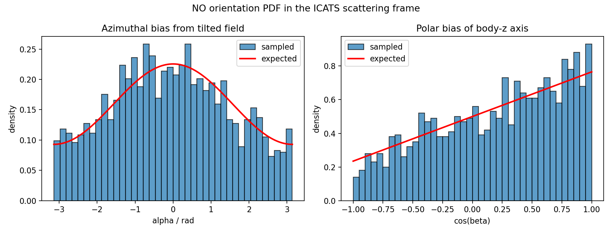

# Tutorials

Tutorials are small, reproducible examples that exercise different parts of the
program. They are not meant to be polished production scattering calculations.
Their purpose is to teach the workflow and catch common setup mistakes.

List available tutorials:

```bash
icats --list-tutorials
```

Generate a named tutorial:

```bash
icats --tutorial single_atom_diatom_he_n2 --setup-only
```

Current tutorials cover:

- `quickstart`: NH3 + H2O baseline workflow.
- `diatomic_n2_n2_fast`: fast N2 + N2 environment sanity check.
- `mixed_h2o_n2`: mixed rotor types.
- `methane_methane`: heavier symmetric-top example.
- `single_atom_he_he`: atom-atom edge case.
- `single_atom_diatom_he_n2`: atom-diatom template.
- `polarized_orientation_he_no`: atom-diatom toy polarization example using a
  user-supplied molecular orientation PDF.
- `fixed_plane_atom_diatom_ar_no`: constrained Ar + NO diagnostic setup. It
  uses `incoming-k = 13.615392`, `fixed-b = 4.5`, `impact-phi = 0.0`,
  `vib-mode = rigid`, `Trot = 0.0`, and `Tvib = 0.0`; it samples only the NO
  orientation and writes combined `out_full.info`, `out_full.xyz`, and
  `out_full.vel` files.
- `flat_l_atom_diatom_ar_no`: Ar + NO diagnostic setup for
  `orbital-sampling = flat-l`. It samples `L` uniformly instead of using the
  geometric `P(L) ~ L` proposal. With rigid NO and `Trot = 0.0`, `Jab = 0` and
  `J = L`, so the L/J histogram check is intentionally easy to interpret.
- `single_atom_diatom_he_n2_wl`: atom-diatom with Wang-Landau weighting.
- `flat_l_atom_diatom_he_n2_wl`: atom-diatom Wang-Landau diagnostic using
  `orbital-sampling = flat-l`. This is the direct companion to
  `single_atom_diatom_he_n2_wl`, but the base orbital proposal is uniform in
  `L` rather than geometric.
- `flat_l_diatom_diatom_n2_n2_wl`: N2 + N2 flat-L Wang-Landau diagnostic with
  two molecular rotors. This is the recommended cheap tutorial for inspecting a
  more balanced flat-`J` WL correction.
- `wang_landau_nh3_h2o`: NH3 + H2O with Wang-Landau weighting.
- `paper_nh3_h2o_100k`: the 100k-sample NH3 + H2O validation ensemble
  used to export the histogram data underlying manuscript Figures 6, 7, and 9.
- `npz_output_co2_co2`: dual xyz/vel and NPZ output.

Tutorials are feature demonstrations. Some use inexpensive mock or
semiempirical settings so that users can learn the workflow before replacing the
toy dynamics with more serious calculations.

## Recommended Learning Order

1. `single_atom_he_he`
   This is the simplest possible case. There are no molecular rotations or
   vibrations, so the output focuses on intermolecular motion.

2. `single_atom_diatom_he_n2`
   Adds one linear rotor. This is the easiest place to learn molecular angular
   momentum output.

3. `fixed_plane_atom_diatom_ar_no`
   Shows how to hold selected intermolecular variables fixed: impact parameter
   `b`, lab impact-plane azimuth `impact-phi`, rigid vibration, and zero
   initial diatom angular momentum. This is mainly an initial-condition
   diagnostic tutorial.

4. `polarized_orientation_he_no`
   Shows how to provide a molecule-level orientation PDF. The example keeps NO
   rigid and non-rotating, then biases the NO body axis with a simple tilted
   field model.

5. `flat_l_atom_diatom_ar_no`
   Shows how to sample orbital angular momentum uniformly rather than
   geometrically. Use it to learn the difference between a proposal ensemble and
   a weighted/geometric cross-section ensemble.

6. `quickstart`
   Introduces two polyatomic molecules and the full file pipeline.

7. `methane_methane`
   Shows a heavier symmetric-top case. This is useful for seeing vibrational
   angular momentum in the analysis.

8. `single_atom_diatom_he_n2_wl`
   Adds Wang-Landau weighting in a relatively cheap system.

9. `flat_l_atom_diatom_he_n2_wl`
   Uses the same one-dimensional Wang-Landau correction on total `J`, but with
   uniform `L` proposals. This is a diagnostic for low-`L` coverage and
   reweighting strategy, not a two-dimensional Wang-Landau calculation.

10. `flat_l_diatom_diatom_n2_n2_wl`
   Uses the same flat-L/flat-J idea for N2 + N2. With two molecular rotors, the
   sampled `Jab` has more angular freedom, so this is a better cheap example of
   the intended balanced WL compromise.

11. `wang_landau_nh3_h2o`
   Demonstrates Wang-Landau sampling in a more demanding polyatomic system.

12. `paper_nh3_h2o_100k`
   Reproduces the paper-scale NH3 + H2O validation settings and exports compact,
   inspectable CSV data. Run this only after the shorter tutorials are working.

## Paper Validation Ensemble

Generate the paper-scale tutorial:

```bash
icats --tutorial paper_nh3_h2o_100k --setup-only
cd tutorial_paper_nh3_h2o_100k
```

The input uses 100k accepted collision samples, `Tvib = Trot = 500 K`, a
90 degree crossed-beam angle, `maxj = 70`, and NH3/H2O beam-speed distributions
centred at 600 and 800 m/s with 100 m/s FWHM. The orbital cap reproduces the
range shown in Figure 9; `J` extends slightly further through the molecular
`Jab` contribution. The tutorial suppresses Cartesian trajectory files because
the purpose is distribution validation rather than dynamics propagation.

The ordinary ICATS command is:

```bash
icats.init tutorial_input.txt
```

Then export the compact data and make the diagnostic plots with:

```bash
python export_paper_histogram_data.py
python plot_paper_histograms.py
```

Alternatively, run all three stages on a Linux desktop with:

```bash
./run_paper_tutorial.sh
```

The input uses four workers. The wrapper sources `tutorial_environment.sh` for
portable cache and thread settings and `find_python.sh` to select Python from
the active environment. It then runs the same three commands shown above while
reusing the supplied, validated `rd_tutorial_input/wang.pkl`.

The exporter writes `paper_histogram_data/` containing raw CSV samples,
histogram tables, and `metadata.json`. The plotter then writes inspectable PNG
and PDF composites to `paper_histogram_plots/`. The files are grouped as follows:

- `figure6_*`: 100k samples of the selected 652.27 cm^-1 NH3 mode at 500 K,
  sampled with the energy-matched leading-Wigner distribution used by ICATS.
- `figure7_*`: NH3 and H2O rotational `J` values, the selected asymmetric-top
  projection centres, and the vector-model body-fixed projections reconstructed
  from the sampled Cartesian coordinates for `J = 5`.
- `figure9_*`: accepted `J`, `L`, `Jab`, relative speed, the estimated
  `Omega(J)`, and the final Wang-Landau acceptance weight.

Figure 8 is not part of this ensemble. It is a fixed-`J`, fixed-eigenstate
asymmetric-top benchmark against Wigner-matrix densities, whereas Figures 6,
7, and 9 test distributions produced by the full collision sampler.

The supplied Wang-Landau profile was built with 4000 trial steps per active
bin, flatness `0.95`, and tolerance `1.0000001`. Reusing it avoids the expensive
learning stage and should allow the four-worker production calculation to
finish in minutes on a modern desktop. Keep `wang.pkl` with the exported
metadata so the exact umbrella can be inspected and reused. Moving it before
running triggers a from-scratch high-quality WL build, which may take about an
hour or longer on four cores.

## Running A Tutorial

The standard pattern is:

```bash
icats --tutorial quickstart --setup-only
cd tutorial_quickstart
icats.init tutorial_input.txt
./run_cheap_dynamics.sh
./run_analysis.sh
```

To generate fewer samples for a fast test:

```bash
icats --tutorial quickstart --nsamp 2 --ntraj 1 --setup-only
```

Before running `icats.init`, inspect the frame convention in
`tutorial_input.txt`:

```text
output-frame = internal
```

This is the historical ICATS/tutorial convention. If the generated xyz/vel
files must match a scattering or QM input convention where the incoming
relative wave vector is along space-fixed `+Z`, change the line before
generation:

```text
output-frame = incoming-k-plus-z
```

Changing `output-frame` changes Cartesian components and SF/BF Euler angles, so
regenerate the samples after changing it. Magnitudes and energies are unchanged.

## What To Inspect

After `icats.init`, inspect:

```text
tutorial_input.txt.logfile
rd_tutorial_input/
rd_tutorial_input/outputs/
```

After analysis, inspect:

```text
rd_tutorial_input/outputs/dynamics0.analinfo
```

Search for:

```text
[energy summary]
[rotation]
[vibration]
[intermolecular]
```

These blocks are the fastest way to understand what ICATS sampled and what the
analysis reconstructed.

## Constrained Ar + NO Tutorial

Use this tutorial when you want a small setup that fixes selected variables
instead of sampling the full intermolecular geometry:

```bash
icats --tutorial fixed_plane_atom_diatom_ar_no --setup-only
cd tutorial_fixed_plane_atom_diatom_ar_no
icats.init tutorial_input.txt
```

The generated input uses:

```text
Trot = 0.0
Tvib = 0.0
vib-mode = rigid
incoming-k = 13.615392
fixed-b = 4.5
impact-phi = 0.0
output-frame = internal
printout = 1 1 0 0
```

This freezes the NO bond at the reference geometry, starts the diatom with no
rigid-rotor angular momentum, fixes the impact parameter and lab impact-plane
azimuth, and still samples the NO bond orientation. Inspect `out_full.info`,
`out_full.xyz`, and `out_full.vel` after `icats.init`.

This tutorial is an initial-condition/export example, not a cheap-MINDO
dynamics example. The PySCF MINDO/3 backend used by `run_cheap_dynamics.sh`
does not support Ar for this setup, so use the generated files for inspection
or pass them to an external dynamics/QM code.

## Polarized NO Orientation Tutorial

Use this tutorial to test a user-supplied molecular orientation PDF. The
example is intentionally simple: He is an atom, NO is rigid and non-rotating,
and the main diagnostic is the biased NO orientation.

```bash
icats --tutorial polarized_orientation_he_no --setup-only
cd tutorial_polarized_orientation_he_no
icats.init tutorial_input.txt
python rd_tutorial_input/histograms/plot_polarization_check.py
```

The generated NO molecule file contains:

```text
orientation-mode = pdf orientation_pdfs.py dipole_field_tilted 0.75 0.7853981633974483 0.0
orientation-frame = scattering
orientation-thin = 100
rot-param = euler
```

The referenced function has the form:

```python
def dipole_field_tilted(alpha, beta, gamma, strength, field_theta, field_phi):
    ...
```

It treats the NO body-fixed `z` axis as a toy dipole and the field direction as
already expressed in the ICATS scattering frame. The example field is tilted by
`pi/4`, so the sampled distribution depends on both `alpha` and `beta`. ICATS
multiplies the user PDF by the Euler measure `sin(beta)`, so the user function
should return only the physical angular weight. In particular, the example
function computes the body-axis direction from the supplied Euler angles, takes
its dot product with the field axis, and returns a non-negative value
proportional to `1 + A cos(theta_muE)`.

The plotting helper writes:

```text
rd_tutorial_input/histograms/plots/polarization/polarized_orientation_check.png
```



The left panel compares sampled `alpha` with the expected azimuthal trend. The
right panel compares sampled `cos(beta)` with the expected linear trend. With
the default tutorial sample count the curves are not production-smooth, but the
tilt and sign should be visible. Increase `Nsamp` if you want a cleaner
diagnostic plot.

## Flat-L Ar + NO Tutorial

Use this tutorial when you want to oversample the small-impact-parameter region
without running Wang-Landau. The default geometric orbital proposal samples
impact parameter area, so `P(b) db ~ b db` and equivalently `P(L) dL ~ L dL`
at fixed incoming momentum. That is the natural choice for direct geometric
averages, but it can leave relatively few samples at small `b`.

The flat-L tutorial deliberately changes only that proposal:

```bash
icats --tutorial flat_l_atom_diatom_ar_no --setup-only
cd tutorial_flat_l_atom_diatom_ar_no
icats.init tutorial_input.txt
```

The generated input contains:

```text
Trot = 0.0
Tvib = 0.0
vib-mode = rigid
incoming-k = 13.615392
maxb = 8.0
impact-phi = 0.0
output-frame = internal
orbital-sampling = flat-l
wang = False
printout = 0 1 0 0
```

As above, this Ar + NO tutorial is not compatible with the bundled
`run_cheap_dynamics.sh` MINDO helper, because PySCF MINDO/3 does not support Ar
for this setup. It is intended for initial-condition diagnostics and histogram
inspection.

Here `orbital-sampling = flat-l` means ICATS proposes `L` uniformly between
zero and the requested upper limit. It does not impose a flat physical
cross-section distribution. If you use these samples to estimate a geometric
quantity, reweight the samples by the missing area factor, proportional to `L`
or `b` at fixed incoming momentum.

This tutorial is intentionally simple. The NO bond is rigid and `Trot = 0.0`,
so the internal rotor contribution is zero: `Jab = 0`. Therefore the total
angular momentum is just `J = L`. That makes it a clean user check: sampled `L`
and sampled `J` should both look roughly flat.

To make histogram helper scripts at setup time:

```bash
icats --tutorial flat_l_atom_diatom_ar_no --histograms --hist-samples 5000 --setup-only
cd tutorial_flat_l_atom_diatom_ar_no
icats.init tutorial_input.txt
mkdir -p rd_tutorial_input/histograms/plots/sampled
python rd_tutorial_input/histograms/sampled/system/hist_sam_sys_orb_sl.py \
  --no-show --outfile rd_tutorial_input/histograms/plots/sampled/hist_sam_sys_orb_sl
python rd_tutorial_input/histograms/sampled/system/hist_sam_sys_orb_sj.py \
  --no-show --outfile rd_tutorial_input/histograms/plots/sampled/hist_sam_sys_orb_sj
```

Inspect the resulting system `L` and `J` plots under:

```text
rd_tutorial_input/histograms/plots/sampled/
```

The broader `plot_sampled.sh` helper is still available, but it plots every
sampled histogram. For this diagnostic tutorial the two system orbital plots
above are usually the useful check.

For this tutorial the important lesson is the shape of the proposal
distribution. It is not a Wang-Landau run, and it is not a replacement for
checking whether the requested `maxb`, `maxl`, and incoming momentum are
appropriate for the physical calculation.

## Flat-L He + N2 Wang-Landau Diagnostic

Use this tutorial to test the combination of uniform-`L` proposals and the
existing one-dimensional Wang-Landau correction on total angular momentum `J`.
It is intentionally a companion to `single_atom_diatom_he_n2_wl`: the molecule
pair and cheap dynamics settings are the same, but the generated input adds

```text
orbital-sampling = flat-l
wang = True
wlmode = default
wl-target = flat-j
wl-j-range = 60
wl-j-bins = 60
wl-l-cap = 59
wl-flatness = 0.95
wl-nstep = 1000
run-mode = fresh
```

This is not a two-dimensional Wang-Landau calculation in `(L,J)`. ICATS still
builds a one-dimensional WL profile for the sampled total `J`. In this tutorial
`wl-target = flat-j`, so the WL acceptance uses `1/Omega_t(J)` rather than the
usual `(2J+1)/Omega_t(J)` target. The practical question is whether proposing `L`
uniformly gives better coverage of the low-`L` region while the WL acceptance
keeps the total-`J` ensemble from becoming badly concentrated.

The final sampled `L` and `J` histograms should be broadly even in the useful
range, but they do not have to be mathematically flat bin-by-bin. This is still
a one-dimensional WL correction on `J`, and the accepted ensemble can retain
small structure where `L`, `J`, and the atom-diatom `Jab` distribution overlap
strongly, especially near `J,L = 0`.

Atom-diatom systems are deliberately stringent tests for this idea. With only
one molecular rotor, a flat low-`J` target can be achieved mainly by accepting
near-cancellation geometries where `L` and `Jab` are anti-aligned. This is not a
generic failure of the WL machinery, but it is a warning that atom-diatom
flat-`J` runs should be interpreted as diagnostics rather than ideal production
examples. Molecule-molecule systems usually have a broader `Jab` distribution
and more angular degrees of freedom, so the same one-dimensional WL correction
can give a more balanced compromise.

The WL controls are deliberately explicit in this tutorial. `wl-j-range = 60`
sets the upper `J` range for the explicit WL density estimate, `wl-j-bins = 60`
sets the resolution within that range, and `wl-l-cap = 59` makes the WL-building
orbital proposal cover the same scale as the production `maxl`. The tutorial
uses the `default` WL profile, with explicit flatness and step settings for a
moderately stricter diagnostic run.

Generate the test directory with histogram helpers:

```bash
icats --tutorial flat_l_atom_diatom_he_n2_wl --histograms --hist-samples 5000 --setup-only
cd tutorial_flat_l_atom_diatom_he_n2_wl
```

Then run the initial-condition generator. This may take noticeably longer than
the non-WL tutorials because it first builds `wang.pkl`:

```bash
icats.init tutorial_input.txt
```

`icats.init` sets writable default cache directories for numba and matplotlib
when the user has not already configured them. The generated tutorial keeps
`workers = 1` for maximum portability. On your laptop or a small workstation,
edit `tutorial_input.txt` to `workers = 4` before running `icats.init` if you
want the WL build to use four parallel workers.

After it finishes, inspect the generated WL file and the log:

```text
rd_tutorial_input/wang.pkl
tutorial_input.txt.logfile
rd_tutorial_input/histograms/wl/
```

The WL helper scripts are written under `rd_tutorial_input/histograms/wl/`.
The exact filenames are generated by the code; list them with:

```bash
find rd_tutorial_input/histograms/wl -maxdepth 1 -type f | sort
```

For the sampled orbital histograms, the most useful quick check is:

```bash
./rd_tutorial_input/histograms/plot_orbital_jljab.sh
./rd_tutorial_input/histograms/plot_orbital_correlation.sh
```

Inspect:

```text
rd_tutorial_input/histograms/plots/sampled/hist_sam_sys_orb_sl.png
rd_tutorial_input/histograms/plots/sampled/hist_sam_sys_orb_sj.png
rd_tutorial_input/histograms/plots/sampled/hist_sam_sys_orb_sjab.png
```

For a sensible diagnostic run:

- `L` should reflect the flat-L proposal modified by WL acceptance.
- `J` should not show an obvious missing-window or hard cutoff inside the
  requested range.
- `Jab` should remain a molecular-rotor distribution, not something manually
  forced by the WL machinery.
- If `J` only looks acceptable because of rare cancellations between `L` and
  `Jab`, inspect `cos(theta_{L,Jab})` and the `J` versus
  `cos(theta_{L,Jab})` heatmap before treating the run as useful. Run:
  `./rd_tutorial_input/histograms/plot_orbital_correlation.sh`.

If you want to compare against the default geometric proposal, generate and run
the sibling tutorial:

```bash
icats --tutorial single_atom_diatom_he_n2_wl --histograms --hist-samples 5000 --setup-only
```

Compare the sampled `L`, `J`, and `Jab` plots between the two directories. The
flat-L tutorial is mainly a coverage and weighting diagnostic; it should not be
used as a production scattering ensemble without an explicit weighting strategy.

## Flat-L N2 + N2 Wang-Landau Diagnostic

Use this tutorial when you want a cheaper molecule-molecule flat-WL example
where the balanced representation is more likely to work than in the
atom-diatom stress case:

```bash
icats --tutorial flat_l_diatom_diatom_n2_n2_wl --histograms --hist-samples 5000 --setup-only
cd tutorial_flat_l_diatom_diatom_n2_n2_wl
```

The generated input uses:

```text
orbital-sampling = flat-l
wang = True
wl-target = flat-j
wl-j-range = 100
wl-j-bins = 50
wl-j-min = 5.0
wl-low-j-scale = 0.15
wl-l-cap = 100
wl-flatness = 0.95
wl-nstep = 1500
```

N2 + N2 has two molecular rotors, so `Jab = Ja + Jb` has more angular freedom
than in He + N2. The flat-`J` target should therefore require fewer
near-cancellation geometries at low `J`. The `wl-j-min = 5.0` and
`wl-low-j-scale = 0.15` settings keep the WL fit from chasing the rare
near-zero-`J` cancellation bin too aggressively. Accepted production samples
below that boundary are still allowed, but with a reduced rejection weight so
that the tutorial favours weaker `L`/`Jab` correlation over perfect very-low-`J`
flatness. This is the intended lesson of the tutorial: for very low `J`, a
visible deficit is often preferable to a flat-looking histogram produced by
strong artificial anti-correlation between `L` and `Jab`.

After running `icats.init`, inspect the same orbital and correlation plots:

```bash
./rd_tutorial_input/histograms/plot_orbital_jljab.sh
./rd_tutorial_input/histograms/plot_orbital_correlation.sh
```

This is the recommended cheap tutorial for checking whether flat-`L` proposals
and flat-`J` WL weighting can produce a reasonably balanced accepted ensemble.
