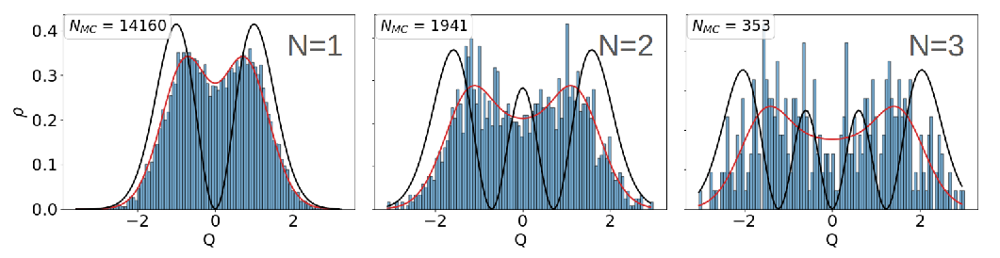

# Visual Guide

These figures are visual anchors for the main ICATS ideas. They are not a
substitute for the equations, but they help connect the output files to the
physical coordinates being sampled.

## Lab And Collision Frames


The lab-frame diagram shows how the two incoming molecular beams define the
experimental geometry. ICATS ultimately converts this into a relative
intermolecular velocity, an initial separation, and a collision angle.

## Intermolecular Angular Momenta


This is the diagram to keep in mind when reading Wang-Landau output. The
orbital angular momentum `L` comes from the incoming collision geometry, while
the molecular rotors contribute `J_A` and `J_B`. ICATS samples and analyses the
vector relation:

$$
\vec{J}=\vec{L}+\vec{J}_A+\vec{J}_B.
$$

## Body-Fixed And Euler Angles


Molecular rotations and orientations are easiest to understand as rotations
between the space-fixed and body-fixed frames. ICATS follows the manuscript
convention for molecular Euler angles:

```text
alpha, beta, gamma
```

These are the angles printed in molecular orientation blocks and in the
space-to-Eckart analysis for each molecule. For linear molecules, rotation
about the molecular axis is a gauge coordinate; ICATS reports `gamma = 0` for
that arbitrary spin angle.

## Two-Vector System Embedding


For a bimolecular collision, ICATS also reconstructs a system body-fixed frame
from the two molecular centres of mass and a second molecular embedding vector.
The system Euler angles are printed as:

```text
phi, beta, chi
```

Here `phi` is the space-fixed azimuth, `beta` is the polar rotation that brings
the system `z` axis onto the Jacobi vector `R_AB`, and `chi` is the final
body-fixed azimuth about that system `z` axis. Older ICATS data may also contain
the key `theta`; it is the same polar angle now labelled `beta` in the manual
and logs.

Do not confuse this reconstructed system `phi` with the input key
`impact-phi`. `impact-phi` fixes or samples the cylindrical azimuth of the
impact parameter in the incoming lab plane. The system Euler angles are
retro-analysed later from the generated Cartesian coordinates.

## Vibrational Phase Space



ICATS samples harmonic vibrational states and then draws phase-space `Q, P`
values from Husimi-style distributions. The histogram does not mean every
sample has exactly the quantum level energy; it means the phase-space ensemble
represents the chosen oscillator state.

## Rotor State Sampling


The rotational state distributions show the two-step character of rotor
sampling: choose a total rotational state and then choose projection or
asymmetric-top vector-model information. The same logic is reconstructed later
in the rotational-analysis block.
