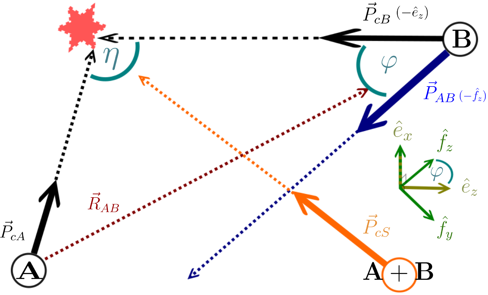
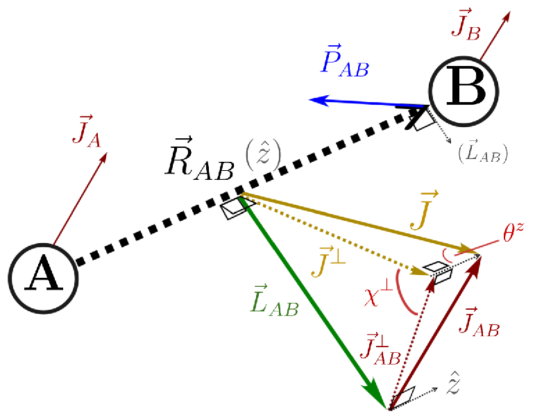
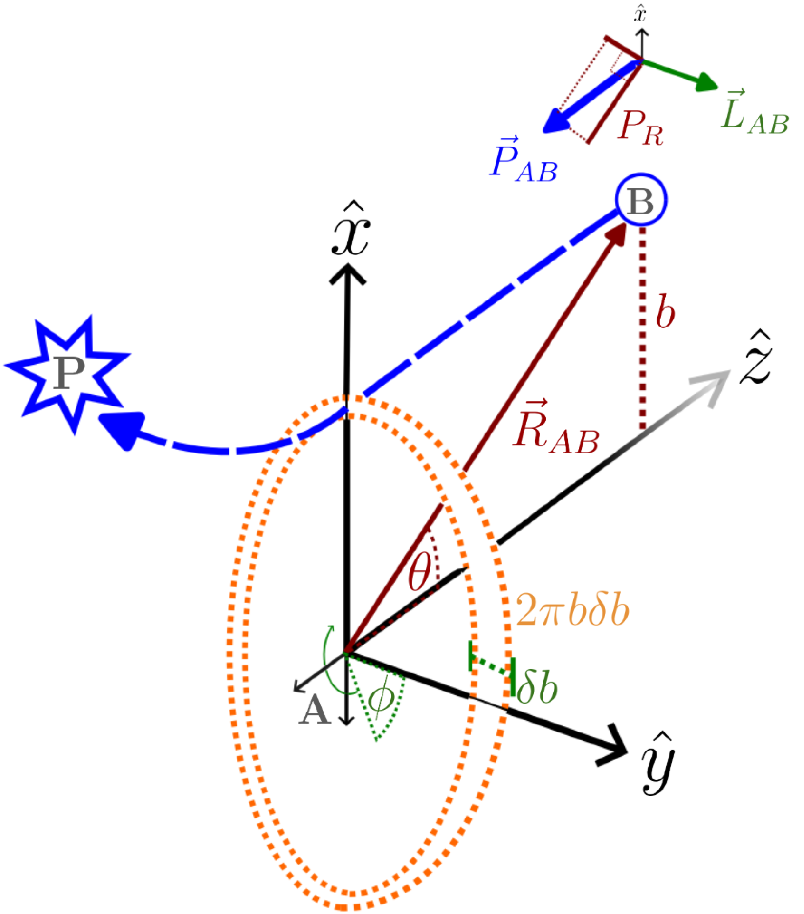
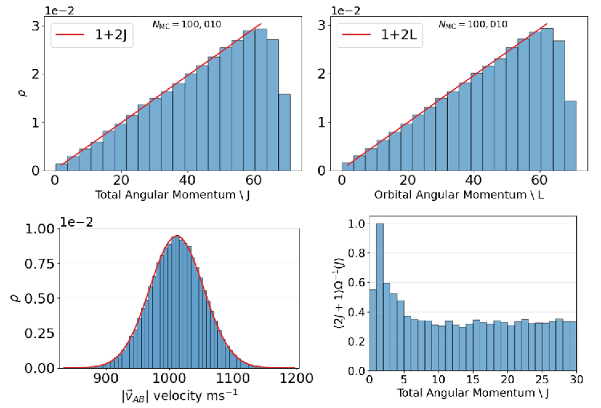
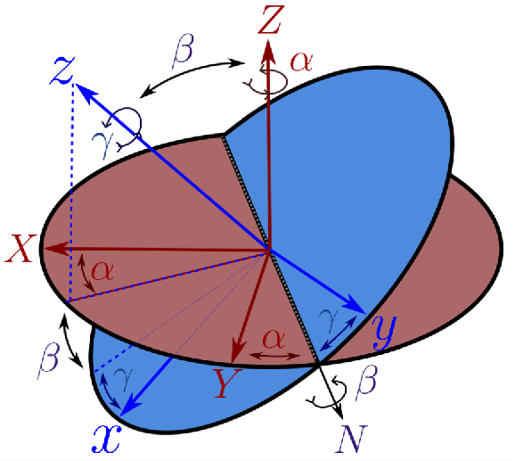
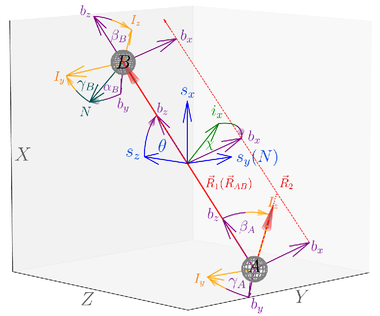
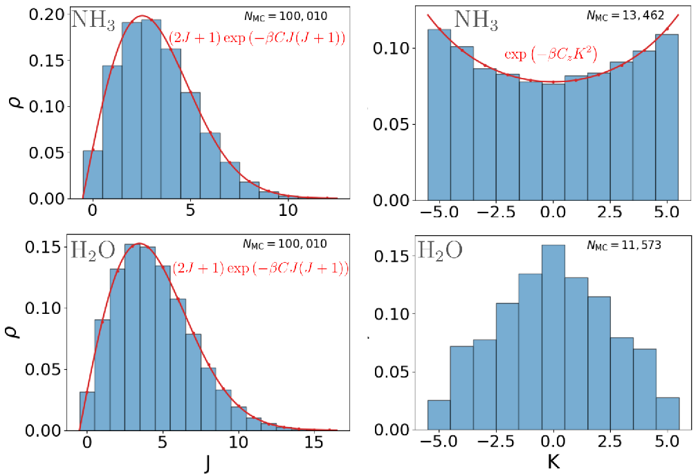
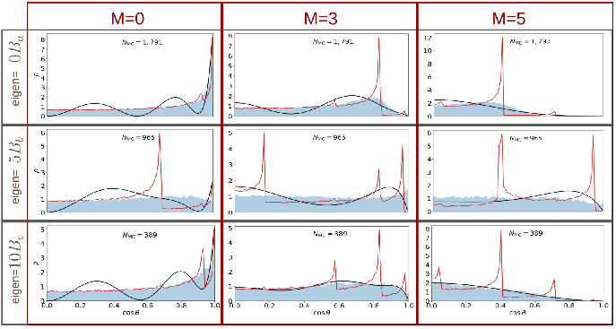
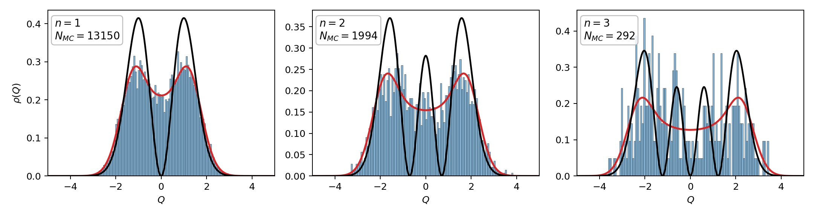

# Visual Guide

These figures are visual anchors for the main ICATS ideas. They connect the
input keys and `.info` output lines to the coordinate systems used in the
manuscript. The equations and logs remain the definitive reference, but these
diagrams are often the quickest way to remember which angle or vector is being
described.

## Choose The Output Frame First

Every tutorial input contains:

```text
output-frame = internal
```

This is the historical ICATS convention. If a downstream scattering or QM code
uses incoming relative wave vector `k` along space-fixed `+Z`, set this before
running `icats.init`:

```text
output-frame = incoming-k-plus-z
```

The `incoming-k-plus-z` option applies an `Rx(pi)` transform to the completed
sample before the `.info` generation block, immediate analysis, audit, and
xyz/vel export are written:

```text
x, y, z -> x, -y, -z
```

This changes vector components, Cartesian coordinates, signs, and SF/BF Euler
angles. It does not change scalar magnitudes such as collision energy, `b`,
`|L|`, `|J|`, vibrational mode energies, or rotor energies.

## Lab And Collision Frames



The lab or space-fixed frame is the Cartesian frame in which ICATS writes
coordinates and velocities. In crossed-beam mode the two molecular beam speeds
and `beam-angle` define the relative incoming velocity. In direct-channel mode
the relative motion is set by one of:

```text
relative-velocity = ...
collision-energy = ...
incoming-k = ...
```

ICATS reduces these inputs to the Jacobi relative channel of the two molecular
centres of mass. In the `.info` file, this appears as:

```text
relative velocity
collision energy
P_R
R_AB
```

The sign of the printed relative momentum depends on `output-frame`. This is
why the frame line should be treated as part of the physical setup, not just as
a formatting preference.

## Impact Plane And Orbital Angular Momentum



The impact parameter and relative momentum define the orbital angular momentum:

```text
L = R_AB cross P_AB
```

The input key

```text
impact-phi = 0.0
```

fixes the lab-frame azimuth of the impact parameter in the incoming plane. It
does not fix the molecular orientation, and it is not the same object as the
system Euler angle `phi` reconstructed later from the Cartesian coordinates.

For fixed-impact-parameter runs, ICATS first sets the incoming relative speed
and then chooses the displacement vector so that the generated Cartesian
sample satisfies the requested relation between `b`, `P_AB`, and `L`. The
important `.info` lines are:

```text
b
impact phi
L
P_R
J = L + Jab
```

## Total Angular Momentum



For two molecules, the total angular momentum is decomposed as:

```text
J    = L + J_AB
J_AB = J_A + J_B
```

Here `L` is the intermolecular orbital part, while `Ja` and `Jb` are the
rotational angular momenta of the two fragments. The `.info` file prints both
the sampled vector-model angular momenta and the immediate Cartesian
reconstruction. For a rigid atom-diatom setup with `Trot = 0`, `Jab = 0`, so
`J = L`. For polyatomic thermal rotors, `Jab` can be large enough that the
sampled `J` distribution should always be inspected.

The frame convention rotates all vectors together. Therefore `L_x`, `L_y`,
`L_z`, `J_x`, `J_y`, and `J_z` may change when `output-frame` changes, while
`|L|` and `|J|` should not.

## Wang-Landau Diagnostics



Wang-Landau is used when the natural orbital proposal and the desired total
`J` coverage are in tension. A geometric proposal samples roughly
`P(L) ~ L`, because it follows the classical impact-parameter area element.
For molecular collisions the sampled total `J` is then mixed with `Jab`.

The practical diagnostic is not only whether a `wang.pkl` file exists. After a
WL run, inspect:

```text
hist_sam_sys_orb_sl.png
hist_sam_sys_orb_sj.png
hist_sam_sys_orb_sjab.png
```

and the WL helper plots under:

```text
rd_tutorial_input/histograms/wl/
```

The WL profile should give sensible `L` and `J` coverage in the range you plan
to analyse. Small deviations near the low-`J`/low-`L` edge can occur because
`L`, `J`, and `Jab` are vector quantities; do not assume the requested target
was achieved without looking at the histograms.

## Molecular Body-Fixed Frames



Molecular rotations and orientations are easiest to understand as rotations
between the space-fixed frame and each molecule's body-fixed or Eckart frame.
ICATS follows the manuscript labels for molecular Euler angles:

```text
alpha, beta, gamma
```

These are printed in molecular orientation blocks:

```text
alpha,beta,gamma = [ ... ] pi rad   # molecular Euler
```

For nonlinear molecules all three angles affect the atom positions. For linear
molecules the final rotation about the bond axis is a gauge coordinate, so
ICATS reports `gamma = 0` for that arbitrary spin angle. The physical bond
direction is carried by `alpha` and `beta`.

## System Jacobi Body Frame



For the two-fragment collision, ICATS also reconstructs a system body-fixed
frame from the Jacobi vector and a second embedding vector. The system Euler
angles are printed as:

```text
system Euler = [ phi, beta, chi ] pi rad
```

Here `beta` is the polar angle associated with the Jacobi vector, `phi` is the
space-fixed azimuth, and `chi` is the final body-fixed azimuth about the
Jacobi/system axis. Older ICATS logs may call the polar angle `theta`; in the
manual and current output it is labelled `beta`.

Do not confuse this reconstructed system `phi` with the input key
`impact-phi`. `impact-phi` is an input control for the impact-parameter
azimuth. `system Euler` is a retro-analysis of the generated Cartesian
geometry.

## Rotor State Sampling



The rotational sampler first chooses the quantum-like rotor labels, then builds
a classical vector-model angular momentum consistent with the top type:

- linear rotor,
- spherical top,
- symmetric prolate or oblate top,
- asymmetric top.

The corresponding `.info` lines include:

```text
rotor type
symmetry constant
vector J, space
vector J, Eckart
vector rot. energy
full rot. energy
```

The `vector` entries are the intended rigid-rotor model. The `full` entries
are reconstructed from the realised Cartesian geometry and velocities. For a
vibrating polyatomic molecule these are not guaranteed to be identical because
instantaneous vibrational displacement can carry residual vibrational angular
momentum.

## Vector Model And Asymmetric Tops




The extended vector model lets ICATS keep a compact classical representation
for different rotor types while still writing Cartesian coordinates and
velocities. For asymmetric tops the code samples state information, constructs
the vector-model rotor contribution, and then the analysis checks what the
Cartesian sample actually contains.

When reading output, compare:

```text
vector J, Eckart
full J, Eckart
vibrational J
vector rot. energy
full rot. energy
```

The `vibrational J` line is the Eckart-frame residual between the full
instantaneous angular momentum and the vector-model rigid-rotor part. It is a
diagnostic of the generated Cartesian state, not a separate sampled quantum
number.

## Vibrational Phase Space



ICATS samples a harmonic vibrational quantum number `vstat`, then draws
phase-space `Q, P` values from the energy-matched leading-Wigner sampler. The
sampler is related to the Wigner/Husimi discussion in the theory section: the
textbook Husimi distribution is positive but has a broader Gaussian envelope,
while the implemented leading-Wigner sampler keeps the Wigner envelope and uses
an energy-matched doubled radial power.

For a fixed state `v`, the sampled radius satisfies the ensemble relation
`<0.5*(Q^2 + P^2)> = v + 0.5`. A single sample does not have to sit exactly on
that energy shell. In the figure, red shows the one-dimensional projection of
the positive leading-Wigner sampler, while black shows the corresponding exact
Hermite-polynomial coordinate density. The red curve is therefore the sampling
model, not the exact coordinate-space quantum probability density.

In `.info` files, the generation block prints:

```text
mode
freq
vstat
Q
P
QE
PE
EE
```

The analysis block projects the realised Cartesian displacement and momentum
back onto the same normal-mode coordinates where possible. If `vib-mode =
rigid`, the generation block says that harmonic oscillator sampling was
skipped. If no Hessian is available, analysis reports an internal-coordinate
residual rather than a harmonic normal-mode table.

## Reading The Figures With Output Files

Use this quick map when reading a tutorial `.info` file:

| Diagram idea | Main input keys | Main output lines |
| --- | --- | --- |
| Lab/collision frame | `output-frame`, `beam-angle`, `relative-velocity`, `incoming-k` | `output frame`, `relative velocity`, `collision energy`, `P_R` |
| Impact plane | `fixed-b`, `maxb`, `impact-phi`, `orbital-sampling` | `b`, `impact phi`, `L` |
| Total angular momentum | `maxl`, `maxj`, `wang`, `wl-target` | `Ja`, `Jb`, `Jab`, `L`, `J = L + Jab` |
| Molecular orientation | `ordist`, `rot-param` | `alpha,beta,gamma`, `wx,wy,wz` |
| Rotor model | `Trot`, molecule geometry/top type | `vector J`, `full J`, `vector rot. energy`, `full rot. energy` |
| Vibrations | `Tvib`, `vib-mode`, `nfreeze`, Hessian/frequencies | `Q`, `P`, `vstat`, `internal residual` |

For a new setup, inspect the annotated `.info` file first, then the histogram
plots. A frame mismatch usually shows up as surprising signs or Euler angles,
while a sampling-range problem usually shows up as missing or distorted `L`,
`J`, or `Jab` histograms.
