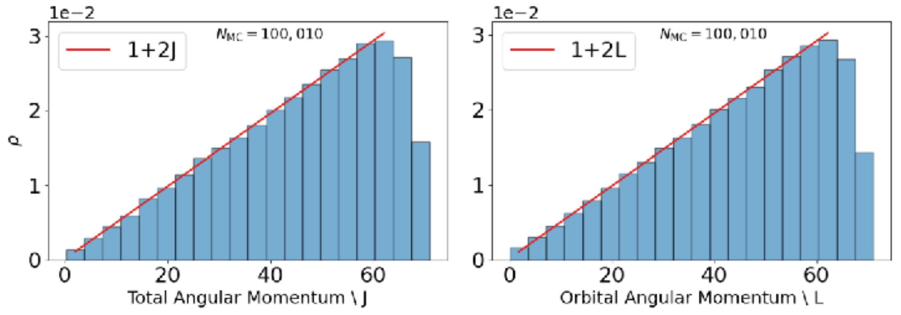
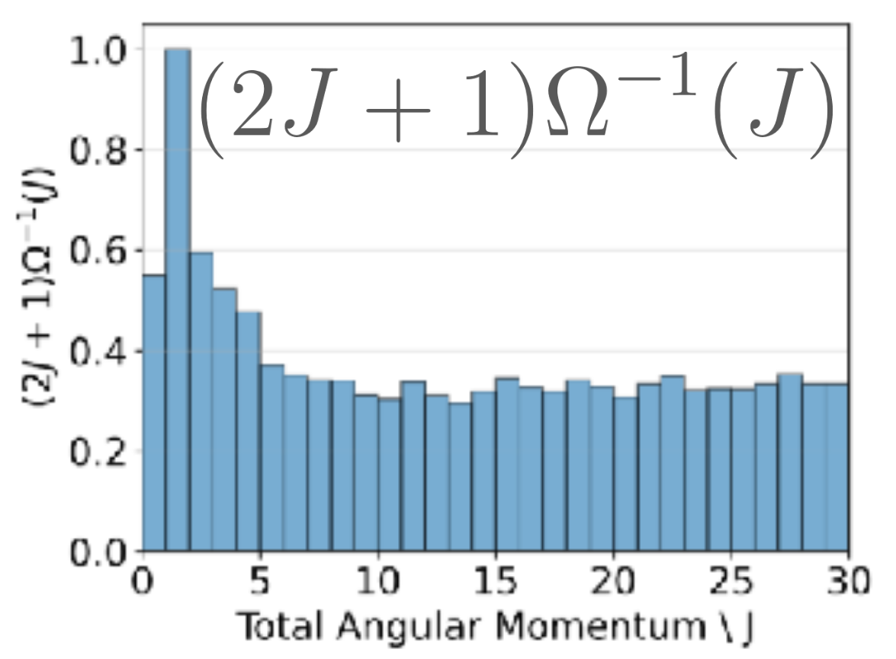

# Wang-Landau Sampling

Wang-Landau sampling is used when direct sampling does not populate the desired
total angular momentum range well enough. This is common when molecular angular
momenta and orbital angular momentum combine to produce a nontrivial density of
states for `J`.

In a molecular collision, `J = L + Jab` as a vector relation. Sampling `L` from
the impact-parameter distribution does not automatically produce the desired
triangular total-`J` distribution, especially at low `J` where the molecular
rotor sum `Jab` is comparable to the orbital angular momentum. Wang-Landau is
used to learn the density-of-states correction needed for this acceptance step.
ICATS currently uses a one-dimensional correction in total `J`; it does not
perform a two-dimensional WL calculation in `(L,J)`.

The tension is between two natural measures:

```text
geometric incoming flux:      d sigma ~ b db  -> roughly linear in L
partial-wave state density:   weight ~ 2J + 1 -> roughly linear in J
```

In the notation used in the theory page this is:

```text
d sigma       proportional to b db
P(L) dL       proportional to (2L + 1) dL
P(J) dJ       proportional to (2J + 1) dJ
```

For atom-atom scattering these are almost the same statement because `J = L`.
For molecular scattering they are not the same statement because `Jab = Ja +
Jb` has its own thermal/vector-model distribution. If ICATS samples a clean
geometric `L` distribution and independently samples the molecular rotors, the
resulting `J` distribution is the vector-coupling mixture of `L` and `Jab`.

```text
J_AB = J_A + J_B
J    = L + J_AB
```

One could try to force both one-dimensional distributions by choosing the angle
between `L` and `Jab` by hand. That would make the histogram look tidy, but it
would also introduce an artificial correlation between the incoming collision
geometry and the molecular internal rotation. Wang-Landau avoids that manual
choice. It first estimates the sampled total-`J` density `Omega(J)` generated
by the chosen `L` proposal and independent `Jab` sampling, then uses an
acceptance weight of the form

```text
W(J) proportional to (2J + 1) / Omega_WL(J)
```

to bring the accepted ensemble closer to the usual degeneracy-weighted
total-`J` measure. This is `wl-target = linear-j`, used with the default
`orbital-sampling = geometric`.

For diagnostic or trajectory-budgeting runs, ICATS can instead propose `L`
uniformly:

```text
orbital-sampling = flat-l
wl-target = flat-j
```

In that case the acceptance correction is

```text
W(J) proportional to 1 / Omega_WL(J)
```

This mode is useful when the user wants to sample low and high `L` more evenly
and later apply their own `L`/`b` reweighting. It should not be read as a
guarantee that the final one-dimensional `L` and `J` histograms will be
perfectly flat; a one-dimensional acceptance in `J` still couples `L`, `J`, and
`Jab`, especially near `J,L = 0`.

For typical crossed-beam conditions, the larger-`L` part of the ensemble is
dominated by orbital angular momentum and already resembles the geometric
impact-parameter measure. Wang-Landau is most useful in the intermediate region
where `L` and `Jab` mix appreciably. The practical aim is balanced sampling:
the accepted `L` and `J` histograms should both remain close to their intended
forms for the selected target, while the angle between `L` and `Jab` is not
being chosen artificially.

## NH3 + H2O Example

The NH3 + H2O tutorial gives a useful visual diagnostic of what a successful
Wang-Landau correction is meant to accomplish.



In this 100k-sample check, the accepted total angular momentum `J` and orbital
angular momentum `L` both remain close to the intended linear degeneracy forms,
`1 + 2J` and `1 + 2L`. The drop near the upper boundary is the expected effect
of a finite requested angular-momentum window.



The corresponding Wang-Landau umbrella is largest at small `J`, where the
molecular rotor sum `Jab` strongly affects the total `J` density of states. At
larger `J`, the umbrella becomes much flatter because the orbital angular
momentum dominates and `J` increasingly tracks `L`.

These images are diagnostic manual figures. For a publication figure, regenerate
the same panels from the final input file, final `wang.pkl`, and archived
sampled histogram data so that the caption can state the exact settings.

Enable Wang-Landau sampling with:

```text
wang = True
```

The generated umbrella is stored as:

```text
rd_<run-tag>/wang.pkl
```

The file stores the umbrella arrays plus metadata describing the settings used
to generate them. If the requested input range is incompatible with the stored
file, ICATS refuses to continue rather than silently reusing the wrong
umbrella.

Useful controls:

```text
wlmode = fast
wl-target = linear-j
wl-angular-sampler = fast
wl-audit-angular-sampler = False
wl-tol = 1.000001
wl-flatness = 0.85
```

`wlmode` is the Wang-Landau parameter preset. `wl-angular-sampler` controls the
numerical implementation used to sample angular momenta during umbrella
generation.

`wlmode = fast` changes the Wang-Landau convergence settings. It is not the same
thing as `wl-angular-sampler = fast`, which controls the numerical shortcut used
to draw angular momenta during the repeated Wang-Landau trial steps.

## Runtime Expectations

Wang-Landau is computationally more expensive than ordinary direct sampling. If
`wang = True` and the run directory does not already contain a compatible
`wang.pkl`, ICATS first builds the umbrella before generating the requested
accepted samples.

For small atom-diatom systems this may be quick. For polyatomic systems, large
`maxj`, strict `wlmode` settings, or many WL bins, the first umbrella build can
take many minutes and can plausibly take an hour or more. Parallel workers help
but do not make the cost disappear:

```text
workers = 4
```

is a reasonable laptop/desktop starting point once the input is known to be
valid. Use `workers = 1` while debugging a new setup because the log is easier
to read and failed input checks return faster.

Subsequent compatible runs reuse `rd_<run-tag>/wang.pkl`, so they skip most of
this cost. If you change the angular-momentum range or WL settings enough to
make the stored umbrella incompatible, ICATS refuses to reuse it.

## Typical Workflow

1. Start from a tutorial that already has Wang-Landau enabled.
2. Run `icats.init tutorial_input.txt`.
3. If `wang.pkl` is absent, ICATS generates it.
4. If `wang.pkl` is present and compatible, ICATS reuses it.
5. Inspect the Wang-Landau plots and sampled `J`, `L` histograms.

For a new molecular system, first run a small calculation and check the plots
before committing to a large sample count.

## Stored Umbrellas

`wang.pkl` is not just a raw array. It includes metadata such as the requested
angular momentum range and Wang-Landau settings. ICATS refuses to reuse an
incompatible umbrella.

If you need to regenerate the umbrella, move the old file aside:

```bash
mv rd_tutorial_input/wang.pkl rd_tutorial_input/wang_previous.pkl
icats.init tutorial_input.txt
```

This avoids accidentally overwriting a useful precomputed umbrella.

## Parameter Guide

| Key | Meaning | Beginner advice |
| --- | --- | --- |
| `wang` | Enables Wang-Landau weighting | Use `True` only when needed |
| `wlmode` | Parameter preset | Start with tutorial defaults |
| `wl-target` | Final `J` target after WL correction | `linear-j` for geometric `L`; `flat-j` for flat-`L` proposal/reweighting runs |
| `wl-angular-sampler` | Numerical implementation | Keep `fast` unless debugging |
| `wl-audit-angular-sampler` | Compare fast and legacy WL angular samplers | Use only for debugging |
| `wl-flatness` | Histogram flatness target | Higher is stricter |
| `wl-tol` | Stopping tolerance for modification factor | Lower tolerance takes longer |
| `wl-j-range` | Upper `J` range for the explicit WL density estimate | Increase if `Jab` has a useful tail beyond the default range |
| `wl-j-bins` | Number of explicit WL density bins | Increase to resolve the selected WL range more finely |
| `wl-l-cap` | Orbital `L` cap used while building the WL umbrella | Match the production `maxl` when testing broad `J` ranges |
| `wl-wn` | Old alias for `wl-j-bins` | Kept for existing inputs |

`PeakJab` is an internal guide to the molecular-rotor angular-momentum scale.
It is useful, but it is not the same as the largest meaningful `Jab` value.
`wl-j-bins` changes the number of bins over the selected WL range. `wl-j-range`
changes the selected upper range itself. If the sampled `Jab` histogram has a
long tail, inspect the WL and `Jab` histograms before relying on the flattened
high-`J` correction.

`wl-target = linear-j` uses the default geometric target
`(2J + 1) / Omega_WL(J)`, where `Omega_WL(J)` is the WL-estimated sampled `J`
density.
This is intended for the usual geometric impact-parameter proposal. For
flat-`L` trajectory-budgeting runs, use `wl-target = flat-j`; this uses
`1 / Omega_WL(J)` and therefore does not add the extra `2J + 1` factor. ICATS
rejects the mixed combinations because they are easy to misinterpret.

## Plotting Checks

After a Wang-Landau run, inspect the learned distribution and weights:

```bash
cd rd_tutorial_input/histograms/wl
python wl_td_plot.py
python wl_wl_plot.py
```

These write `wl_td_plot.png` and `wl_wl_plot.png` in the same directory.
The `wl_wl_plot` figure is the estimated natural sampled density
`Omega_WL(J)`, shown in normalized plotting units. It is not an absolute
density of states.
The `wl_td_plot` figure is the normalized sampling correction used to target
the requested total-`J` distribution: `(2J + 1) / Omega_WL(J)` for
`wl-target = linear-j`, or `1 / Omega_WL(J)` for `wl-target = flat-j`.

Read these plots together with the sampled `L`, `J`, and `Jab` histograms. A
smooth WL curve by itself does not prove that the requested range, binning, or
target distribution is appropriate for the physical question.

Initial and sampled angular-momentum histograms can be generated with:

```bash
./rd_tutorial_input/histograms/plot_initial.sh
./rd_tutorial_input/histograms/plot_sampled.sh
```

For the focused system angular-momentum check, generated tutorials also include:

```bash
./rd_tutorial_input/histograms/plot_orbital_jljab.sh
```

These plots are a practical sanity check that the requested `J` and `L` ranges
are populated sensibly.

## What To Look For

A useful Wang-Landau run should show:

- sampled `J` values spanning the requested useful range,
- no sharp unexplained cutoff inside the intended range,
- `L` values broad enough for the intended impact parameters,
- an umbrella that changes smoothly enough to be physically plausible.

If the run refuses to start because `wang.pkl` is too short or incompatible,
that is a successful safety check rather than a crash. Regenerate the umbrella
for the new requested range.

For a tutorial-quality stored umbrella, the aim is not perfect production
convergence. The aim is that the resulting sampled `J` and `L` histograms are
smooth, cover the requested region, and do not show obvious boundary artefacts
that would hide mistakes in the rest of the workflow.

## Always Inspect The Result

Do not assume a Wang-Landau run is good just because it completed. Inspect:

- the sampled `J` histogram,
- the sampled `L` histogram,
- the `Jab` distribution if available,
- the WL acceptance function,
- any obvious correlation diagnostic between `L` and `Jab`.

The aim is not to prove that every distribution is mathematically perfect. The
aim is to avoid obvious bias while representing both the geometric collision
measure and the total-angular-momentum state density reasonably.
